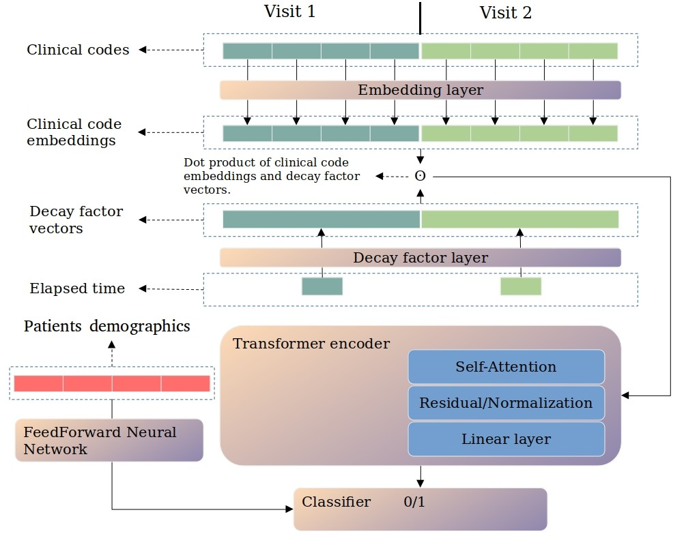

# TransformerDeacy
Transformer with decay factor dedicated to weight visit information (diagnoses and procedures) based on their data.

# Requirements
```
tensorflow==2.9.2
tensorflow==2.9.0
```

# Architecture


# Run the files in this order
1. data_extraction.py
2. samples_creation.py
3. training/transformerdecay.py
